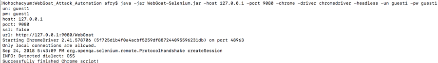
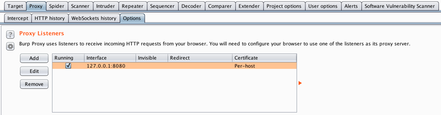
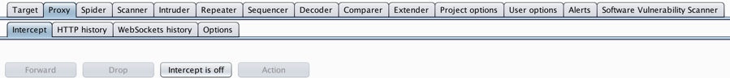
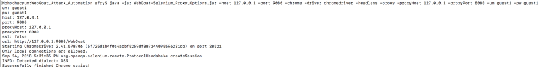
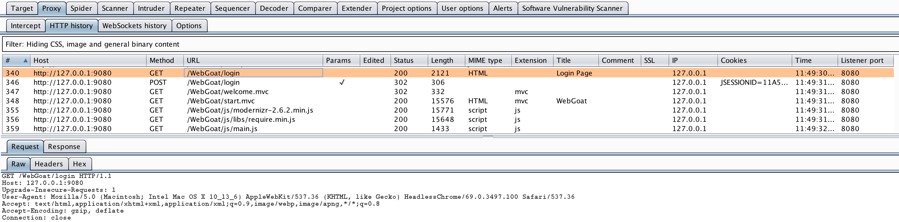
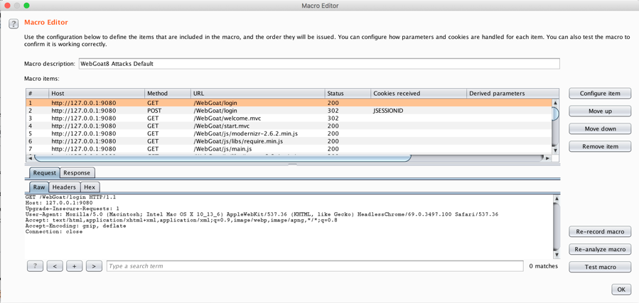
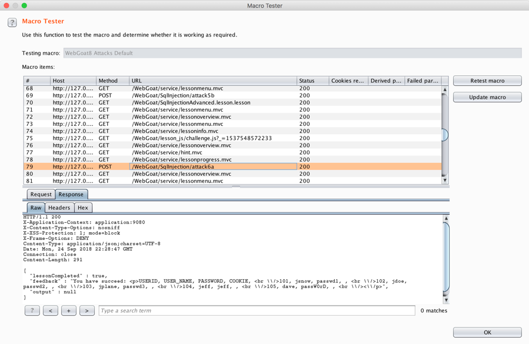
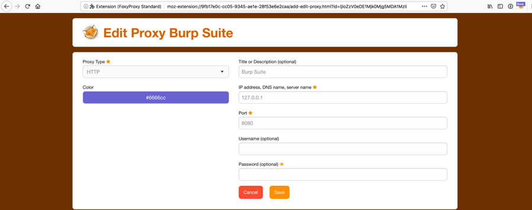
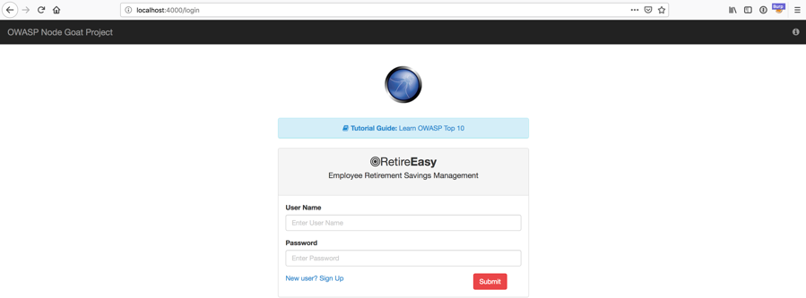

# Attack Automation

## WebGoat

The WebGoat8-Selenium project was used to seed the attacks on the
WebGoat application. The project is written in Java and is coded to
login to the WebGoat application and sequentially attack and exploit
vulnerabilities. The project can be downloaded from:
*https://github.com/contrastsecurity/WebGoat8-Selenium*. Once WebGoat8
is up and running, the WebGoat8-Selenium project is run from the command
line with various arguments. For example, the following screenshot shows
the project run with arguments for WebGoat8 running on localhost
(127.0.0.1), TCP port 9080, using the Chrome browser, driver for the
Chrome browser, headless mode and the login credentials for the guest1
user (Figure 1).

Figure 1. Running WebGoat8-Selenium Project on Command Line

If the project is run in headless mode, there is no visible progress
until the phrase ¨Successfully finished Chrome script!" is output to the
console. When the headless argument is omitted, a Chrome browser is
launched and the project cycles through the attacks and closes the
browser. In order to capture the attack traffic, the functionality to
direct the attack traffic through an HTTP Proxy was added to the Java
code for both the Chrome and Firefox scripts. The WebGoat8-Selenium
source code is hosted on GitHub in a public repository. To contribute
the code back to the WebGoat8-Selenium project, a new fork was created
with a new branch called *feature/proxy\_support*. The changes were
committed to this branch and Pull Request \#1 was created to merge these
changes with the main project. The fork and branch that contains these
changes is published at:
*https://github.com/alexanderfry/WebGoat8-Selenium/tree/feature/proxy\_support*.

Burp Suite Professional was run from the command line and the Proxy was
configured to listen on localhost (127.0.0.1), TCP port 8080 and
Intercept was turned off as shown in the following two screenshots
(Figure 2).

Figure 2. Enable Burp Proxy Listener and Turn Intercept Off

After the WebGoat8-Selenium project was re-compiled with proxy support,
the project was run with the additional arguments for proxy, proxyHost
and proxyPort (Figure 3).

Figure 3. Running WebGoat8-Selenium through Burp Proxy

The project traffic flowed through Burp Proxy and was captured. The
following screenshot shows an excerpt of that traffic in Proxy-\>HTTP
history tab (Figure 4).

Figure 4. WebGoat8-Selenium traffic in Burp Proxy HTTP history

A Burp Macro was created with the full sequence of attack traffic
captured in HTTP history. The macro functionality is found under the
Project Options-\>Sessions tab in the Macros window. After clicking
*Add*, the Macro Recorder displays the HTTP history. Then the HTTP
history for the entire attack sequence was selected. After the *OK*
button was clicked, the Macro Editor was displayed, and the name
WebGoat8 Attacks Default was chosen for the Macro description. The
following screenshot shows the Macro Editor with an excerpt of the
attack traffic (Figure 5).

Figure 5. Burp Macro Editor WebGoat8 Attacks

The Macro was run by clicking the *Test macro* button in the lower
right-hand corner of the Macro Editor window. The Macro Tester window
appears and runs through the attack sequence. The attack sequence causes
a java.lang.NullPointerException in WebGoat8 during one of the attacks.
In order to ensure clean results, the WebGoat server was restarted each
time before replaying the attack sequence. The success of each proof of
concept exploit was verified by viewing the HTTP Response in the Macro
Tester window. A sample HTTP Response is shown for the
SqlInjectionAdvanced Lesson 2 in the following screenshot (Figure 6).

Figure 6. Burp Macro Tester WebGoat8 Attacks

Some of the proof of concept exploits failed to exploit the WebGoat8
vulnerabilities. For example, two XML Entity Injection (XXE) attacks
failed to exploit the WebGoat8 vulnerabilities and were modified in the
Macro to execute successfully. The Macro was edited to preserve only the
successful proof of concept exploits. In addition, the attack that
appeared to cause the java.lang.NullPointerException was removed. The
initial set of proof of concept exploits consisted of three unique
exploits for SQL Injection, two unique exploits for XXE, one exploit for
Cross-site Scripting (XSS) and one Insecure Direct Object Reference.

## NodeGoat

Once NodeGoat was running as described in Section 2.12, the FoxyProxy
Standard extension was configured in Firefox Quantum v63.0.3 (64-bit) so
that all HTTP traffic would use Burp Proxy. FoxyProxy makes it easy to
switch among different proxy configurations (Figure 7).

Figure 7. FoxyProxy Standard Configuration

After browsing to the NodeGoat login screen, NodeGoat authentication was
completed using the default *user1* credentials (Figure 8).

Figure 8. OWASP NodeGoat Login Page

Subsequently the known vulnerabilities in NodeGoat were manually
exploited using the OWASP NodeGoat Tutorial as a guide (OWASP, 2016).
The traffic from this process was captured in the Burp Proxy HTTP
history. As was the case with the WebGoat application, a Burp Macro was
created from the HTTP history and used to automate the attack on the
NodeGoat application. After creating the Macro, it was run by clicking
the *Test macro* button in the lower right-hand corner of the Macro
Editor window. The Macro Tester window appears and runs through the
attack sequence. The proof of concept exploits were modified until they
executed successfully. Once all the exploits were verified, the *Update
Macro* button was used to update the Macro. The initial set of proof of
concept exploits was created for each of the following vulnerabilities:
NoSQL Injection, Server-Side JavaScript Injection, Reflected Cross-site
Scripting (XSS), Insecure Direct Object Reference, Missing Function
Level Access Control and Unvalidated Redirect.
