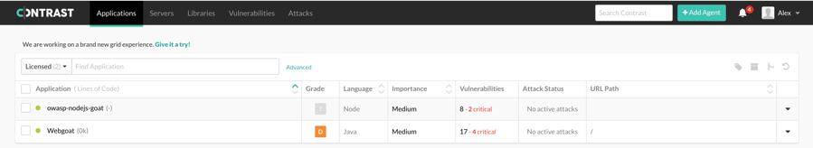

# Integration of Goat Applications with Contrast

## Contrast and NodeGoat

The first step to add a Contrast Agent to NodeGoat is to login to the
Contrast portal and click on *+AddAgent* in the upper right-hand corner
(Figure 1).

Figure 1. Add Agent

On the next screen, the Node.js Agent is selected from the dropdown list
and the *Download Agent* button is clicked to download the Agent (Figure 2).

Figure 2. Download the Agent

Once the Agent is downloaded, the *Next* button will be visible. After
clicking the *Next* button, the second step provides instructions on
choosing a configuration. The Agent does not come with a configuration
file packaged into it. The options are to download a preconfigured one
or create a custom configuration. The preconfigured configuration was
downloaded for NodeGoat (Figure 3).

Figure 3. Choose Configuration

After clicking the *Download Config File* button, the *Next* button
becomes visible. After clicking the *Next* button, step 3 provides
instructions to install the Agent on the server (Figure 4).

Figure 4. Install on Your Server

The Agent was copied to the NodeGoat root directory and installed with
the command *npm install node\_contrast-1.32.0.tgz*. After installation,
the Node.js agent can either be run with the command *node-contrast
server.js* or using *npm*. The configuration change was made to use
*npm* to run contrast. After clicking the *Next* button, step 4 provides
instructions to restart the server with the Contrast Agent enabled and
to begin browsing the application (Figure 5).

Figure 5. Restart Your Server

Then NodeGoat was started with *npm run contrast* with the debug output
option (Figure 6).

Figure 6. Running NodeGoat with Contrast Agent

Next, it was necessary to log in to the NodeGoat application and browse
a few of the features on the left side navigation bar. The browsing was
performed as a normal user, not an admin (Figure 7).

Figure 7. NodeGoat Dashboard

After browsing NodeGoat and returning to the Contrast portal, clicking
on the *Next* button will bring up step 5. This screen will verify that
the connection was received or if there is no connection, it will
provide instructions on troubleshooting the connection (Figure 8).

Figure 8. Verify Connection

Once the Agent is communicating properly, the screen will show
Congratulations and the *Start Using Contrast* button will become
visible (Figure 9).

Figure 9. Start Using Contrast

Clicking on this button will navigate to the *Applications* screen. In
the dropdown menu, select *Apply License* or click the *Unlicensed* link
beside the application name. Once the application is licensed, selecting
the *Licensed* option from the dropdown list in the upper-left hand
corner will show the licensed applications (Figure 10).

Figure 10. Licensed Applications

Contrast Protect is licensed per server. To license the server, navigate
to the *Servers* screen. If there is an *Unlicensed* link beside the
server name, it is necessary to click on the link to apply the license
(Figure 11).

Figure 11. Before Enabling Contrast Protect for NodeGoat

A popup window for *Apply License* will appear. There is an option to
check the box for "Enable output of Protect events to syslog". Make sure
the box is unchecked and click the *Apply License* button (Figure 12).

Figure 12. Apply Protect License

Once the server is licensed, enable the *Contrast Protect* switch on the
right side of the screen and disable the *Contrast Assess* switch. It
will be necessary to restart the server for the changes to take effect
(Figure 13).

Figure 13. Contrast Protect Enabled for NodeGoat

The server was restarted by terminating NodeGoat with CTRL-C and then
starting NodeGoat again with the *npm run contrast* command and debug
output option. The console messages do not reflect that Contrast Protect
is enabled (Figure 14).

Figure 14. Running NodeGoat with Contrast Protect

## Contrast and WebGoat

The first step to add a Contrast Agent to WebGoat is to login to the
Contrast portal and click on *+AddAgent* in the upper right-hand corner
(Figure 15).

Figure 15. Add Agent

On the next screen, the Java Agent is selected from the dropdown list
and the *Download Agent* button is clicked to download the Agent (Figure
16).

Figure 16. Download the Agent

Once the Agent is downloaded, the *Next* button will be visible. After
clicking the *Next* button, the second step provides instructions on
installing the Agent for each Container. WebGoat uses the Tomcat
container (Figure 17).

Figure 17. Install on Your Server

After clicking the *Next* button, step 3 provides instructions to
restart the server with the Contrast Agent enabled and to begin browsing
the application (Figure 18).

Figure 18. Restart Your Server

Then WebGoat is run with the following command to enable the Contrast
Agent, *java -Dcontrast.standalone.appname=Webgoat
-Dcontrast.override.appname=Webgoat -javaagent:contrast.jar -jar
webgoat-server-8.0.0.M21.jar \--server.port=9080*.

Next, it is necessary to log in to the WebGoat application and browse a
few of the lessons on the left side navigation bar (Figure 19).

Figure 19. WebGoat SQL Injection Lesson

After browsing WebGoat and returning to the Contrast portal, clicking on
the *Next* button will bring up step 4. This screen will verify that the
connection was received or if there is no connection, it will provide
instructions on troubleshooting the connection (Figure 20).

Figure 20. Verify Connection

Once the Agent is communicating properly, the screen will show
Congratulations and the *Start Using Contrast* button will become
visible (Figure 21).

Figure 21. Start Using Contrast

Clicking on this button will navigate to the *Applications* screen. In
the dropdown menu, select *Apply License* or click the *Unlicensed* link
beside the application name. Once the application is licensed, selecting
the *Licensed* option from the dropdown list in the upper-left hand
corner will show the licensed applications (Figure 22).

Figure 22. Licensed Applications

Contrast Protect is licensed per server. To license the server, navigate
to the *Servers* screen and enable the *Contrast Protect* switch on the
right side of the screen and disable the *Contrast Assess* switch. It
will be necessary to restart the server for the changes to take effect
(Figure 23).

Figure 23. Enable Contrast Protect

After restarting the server, the console messages will reflect that only
*Contrast Protect* is enabled (Figure 24).

Figure 24. Contrast Protect is On
