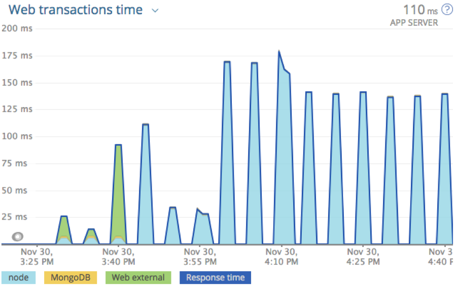
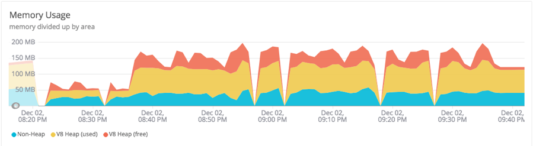

# NodeGoat Normal Traffic

A visual representation of NodeGoat Normal Traffic is shown in the
following overview of Web transactions time with each test case in
groups of three runs (Figure 1).

Figure 1. NodeGoat Normal Traffic Web Transactions Time

The following graph represents Node VM memory usage during the time
NodeGoat responded to normal traffic (Figure 2).

Figure 2. NodeGoat Normal Traffic Node VM Memory Usage

The following graph represents Node VM CPU utilization during the time
NodeGoat responded to normal traffic (Figure 3).

Figure 3. NodeGoat Normal Traffic Node VM CPU Utilization

# NodeGoat Attack Traffic

A visual representation of NodeGoat Attack Traffic is shown in the
following overview of Web transactions time with each test case in
groups of three runs (Figure 4).

Figure 4. NodeGoat Attack Traffic Web Transactions Time

The following graph represents Node VM memory usage during the time
NodeGoat responded to attack traffic (Figure
5).
Figure 5. NodeGoat Attack Traffic Node VM Memory Usage

The following graph represents Node VM CPU utilization during the time
NodeGoat responded to attack traffic (Figure 6).

Figure 6. NodeGoat Attack Traffic Node VM CPU Utilization

# WebGoat Normal Traffic

A visual representation of WebGoat Normal Traffic is shown in the
following overview of Web transactions time with each test case in
groups of three runs (Figure 7).

Figure 7. WebGoat Normal Traffic Web Transactions Time

The following graph represents JVM memory usage during the time WebGoat
responded to normal traffic (Figure 8).

Figure 8. WebGoat Normal Traffic JVM Memory Usage

The following graph represents overall memory usage during the time
WebGoat responded to normal traffic (Figure 9).

Figure 9. WebGoat Normal Traffic Overall Memory Usage

The following graph represents overall CPU usage during the time WebGoat
responded to normal traffic (Figure 10).

Figure 10. WebGoat Normal Traffic CPU Usage

# WebGoat Attack Traffic

A visual representation of WebGoat Attack Traffic is shown in the
following overview of Web transactions time with each test case in
groups of three runs (Figure 11).

Figure 11. WebGoat Attack Traffic Web Transactions Time

The following graph represents JVM memory usage during the time WebGoat
responded to attack traffic (Figure 12).

Figure 12. WebGoat Attack Traffic JVM Memory Usage

The following graph represents overall memory usage during the time
WebGoat responded to attack traffic (Figure 13).

Figure 13. WebGoat Attack Traffic Overall Memory Usage

The following graph represents overall CPU usage during the time WebGoat
responded to attack traffic (Figure 14).

Figure 14. WebGoat Attack Traffic CPU Usage
