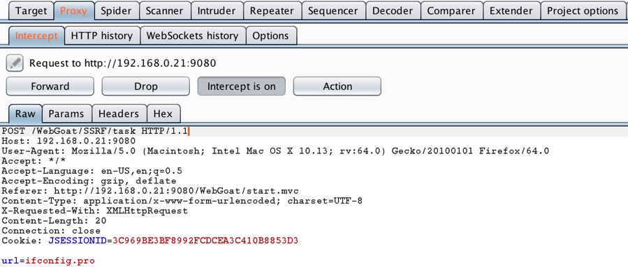
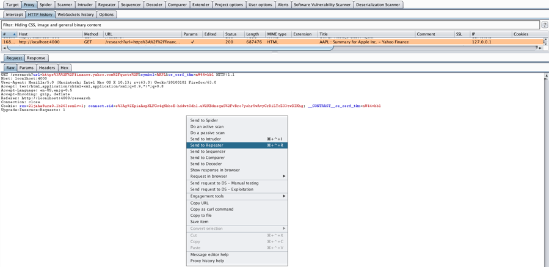

# Vulnerability Development

A Server-Side Request Forgery (SSRF) vulnerability was added to both
WebGoat and NodeGoat to determine if the Contrast Protect RASP solution
would protect against a previously unknown vulnerable condition. OWASP defines an SSRF attack as one in which the attacker can abuse functionality on the server to read
or update internal resources. The attacker can supply or a modify a URL
which the code running on the server will read or submit data to, and by
carefully selecting the URL, the attacker may be able to read server
configuration such as AWS metadata, connect to internal services like
HTTP-enabled databases or perform HTTP POST requests towards internal
services which are not intended to be exposed.

An SSRF vulnerability was chosen because it is capable of being
identified through the use of automated vulnerability scanning tools.
For example, Contrast Assess, the complement of the Contrast Protect
tool, contains a rule to identify SSRF vulnerabilities. In addition,
SSRF is a relatively recent vulnerability. A casual review of search
engine results for the SSRF and Server-Side Request Forgery keywords find results no
older than 2015, less than four years. Finally, neither WebGoat nor NodeGoat had
an SSRF vulnerability lesson or feature respectively.

## Adding an SSRF Vulnerability to WebGoat

The WebGoat8.0 application provides a *getting-started.MD* file and a
template directory that describes how to add a lesson to the
application. This template is located in the template directory:
*WebGoat/webgoat-lessons/webgoat-lesson-template*.

To add the SSRF lesson to WebGoat, files were created and modified in
the *webgoat-lessons* directory. The *pom.xml* file in this directory
was modified to include a new module called *ssrf*.

The SSRF lesson is located under *Request Forgeries* in the left navigation bar (Figure 1).

Figure 1. WebGoat SSRF Lesson

To exercise the functionality in this lesson, a user clicks the "Steal
the Cheese" button on the following page. The application processes the
request, loading a local image of Tom, from the cartoon Tom and Jerry,
and displays it to the user (Figure 2).

Figure 2. WebGoat SSRF Lesson - Tom

To steal the cheese, a user must intercept the HTTP Request in an HTTP proxy like Burp and change the HTTP Request to load a local
image of Jerry, from the cartoon Tom and Jerry. The following screenshot
shows the Request with the modified *url* parameter in Burp and the HTTP
Response in the browser (Figure 3).

Figure 3. WebGoat SSRF Lesson - Jerry

Now that the user has proven they are able to modify the HTTP Request to
load a different local image, they are asked to modify the HTTP Request
to load ifconfig.pro, a website on the Internet that displays network
configuration information from the server where it is loaded. The
following screenshot shows the HTTP Request with the modified *url*
parameter in Burp and the HTTP Response in the browser (Figure 4).

Figure 4. WebGoat SSRF Lesson -- Cat Who Needs Human Assistance

The user modified the HTTP Request to use ifconfig.pro, but it did not
load. Instead, an image of a cat in need of assistance is displayed. If the user
doesn't understand what went wrong, they can click repeatedly on the
"Show hints" button at the top of the screen. The last hint tells them
how to modify the request to get the results they intended (Figure 5).

Figure 5. WebGoat SSRF Lesson -- Hint to a Successful Lesson

The user must return to modify the HTTP Request again. The following
screenshot shows the HTTP Request with the correctly modified *url*
parameter in Burp and the HTTP Response in the browser (Figure 6).

Figure 6. WebGoat SSRF Lesson -- Successful Completion

The code for the SSRF lesson was contributed back to the WebGoat project and merged into the master branch of the project as of version v8.0.0.M25. The public GitHub repository for WebGoat is located at *https://github.com/WebGoat/WebGoat*. The fork and branch that contains these changes is published at:
*https://github.com/alexanderfry/WebGoat/tree/feature/ssrf*.

## Adding an SSRF Vulnerability to NodeGoat

NodeGoat is a Node.js application that uses the Express
*<https://expressjs.com>* web application framework and MongoDB
database. The application consists of four main directories: assets,
data, routes and views. The assets folder contains static assets such as
JavaScript, CSS, HTML and images. The routes folder contains
functionality that handles requests and forwards requests to appropriate
controller functionality. The data folder contains functionality for
MongoDB database interaction. The views folder contains the templates
used by the controller functionality to render the data.

To add the SSRF vulnerability to NodeGoat,
files were created and modified in the routes, views and data
directories. In addition, the *needle* *npm* package was added to the
*package.json* file. 

The vulnerability is located in
the Stock Market Research page. (Figure 7).

Figure 7. NodeGoat Research Page

To exercise the functionality on this page, a user enters a stock
symbol, e.g., AAPL (Apple Inc.), and clicks on the Submit button. The
application processes the HTTP Request and displays a Yahoo Finance page
showing the AAPL stock price and other information (Figure 8).

Figure 8. Yahoo Finance Page with Stock Quote

The URL bar on the Yahoo Finance page shows two HTTP request parameters,
*url* and *symbol*. The *url* parameter is also in a hidden field in the
Stock Research Page source (Figure 9).

Figure 9. NodeGoat Research Page Source

In order to exploit this vulnerability, the HTTP Get request for the
AAPL stock symbol is identified in Burp HTTP history and sent to Burp
Repeater. This is done by right-clicking on the Request and selecting
"Send to Repeater" (Figure 10).

Figure 10. NodeGoat Research Page Request Send to Repeater

Once in the Burp Repeater, the HTTP Request can be modified. After
modifying the Request, the Request is sent by clicking the "Go" button.
The HTTP Response is displayed in the corresponding window on the right
(Figure 11).

Figure 11. NodeGoat Research Page Request and Response

### Exploiting SSRF Vulnerability to View Internal Applications

The *symbol* parameter is concatenated to the *url* parameter in order
to fetch the Yahoo Finance stock symbol information. An example exploit
is to modify the *url* and *symbol* parameters to view the WebGoat site
running on localhost. To accomplish this exploit, both the *url* and
*symbol* parameters were modified in the following manner:
*url=http%3A%2F%2Flocalhost%3A9080%2FWebGoat%2flog&symbol=in*. Decoding
the URL encoding, the URL resolves to <http://localhost:9080/login>.
After clicking "Go", the HTTP Response shows the source for the WebGoat
login page (Figure 12).

Figure 12. NodeGoat Research Page Response Viewing WebGoat Login

To further test the exploitability of the SSRF vulnerability, a simple
web page is created on another host and IP address that reveals
information about the devices on the network. This example is meant to
simulate REST interfaces that may be exposed without authentication such
as those belonging to an IP address management system. After clicking
Go, the HTTP Response shows the source code to an "Internal Application"
(Figure 13).

Figure 13. NodeGoat Research Page Response Viewing Internal Application

Showing the HTTP Response in the browser is accomplished by
right-clicking on the Request pane and selecting "Show response in
browser" (Figure 14).

Figure 14. NodeGoat Research Page Request Show Response in Browser

The following screen shot shows the HTTP Response in the browser (Figure 15).

Figure 15. NodeGoat Research Page Internal Application Response in
Browser

The code for the Research page and a tutorial that teaches exploitation and prevention of the SSRF vulnerability were contributed back to the NodeGoat project. The code was accepted by the NodeGoat maintainer and merged into the master branch of the project. The public GitHub repository for NodeGoat is located at *https://github.com/OWASP/NodeGoat*. The fork of the NodeGoat project that contains the Research page is located at: *https://github.com/alexanderfry/NodeGoat/tree/ssrf*.